# Eva Architecture Documentation

## Table of Contents
1. [System Overview](#system-overview)
2. [Component Architecture](#component-architecture)
3. [Data Flow](#data-flow)
4. [Security Model](#security-model)
5. [Memory System](#memory-system)
6. [API Design](#api-design)

## System Overview

Eva is built on a **hybrid architecture** that optimizes for both security and performance:
- **Client-side Realtime** - Direct browser-to-OpenAI connection for low-latency audio
- **Server-side Memory** - Backend API layer protects graph database access

### High-Level Architecture

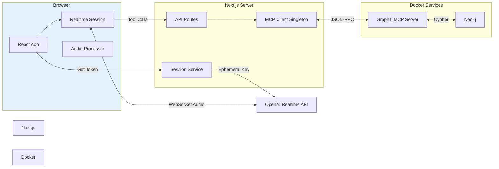

## Component Architecture

### Frontend Components

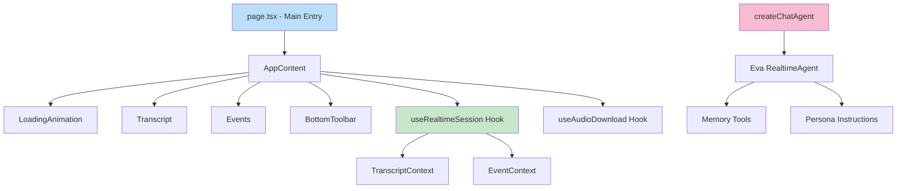

### Backend Components

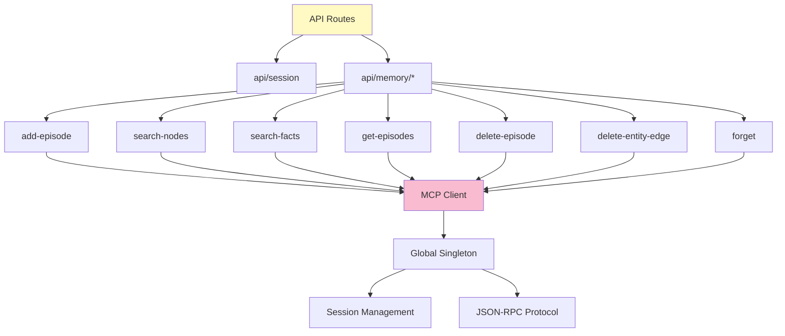

### Agent Tool Architecture

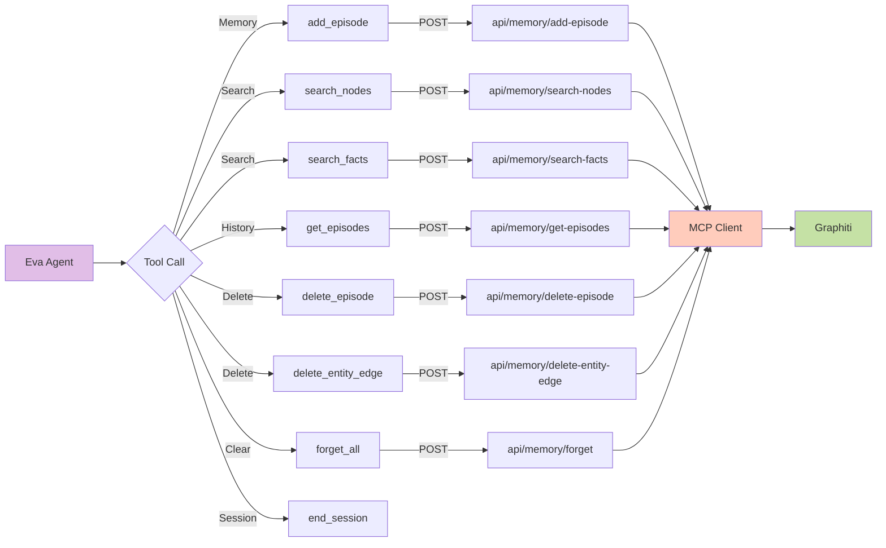

## Data Flow

### Conversation Initialization Flow

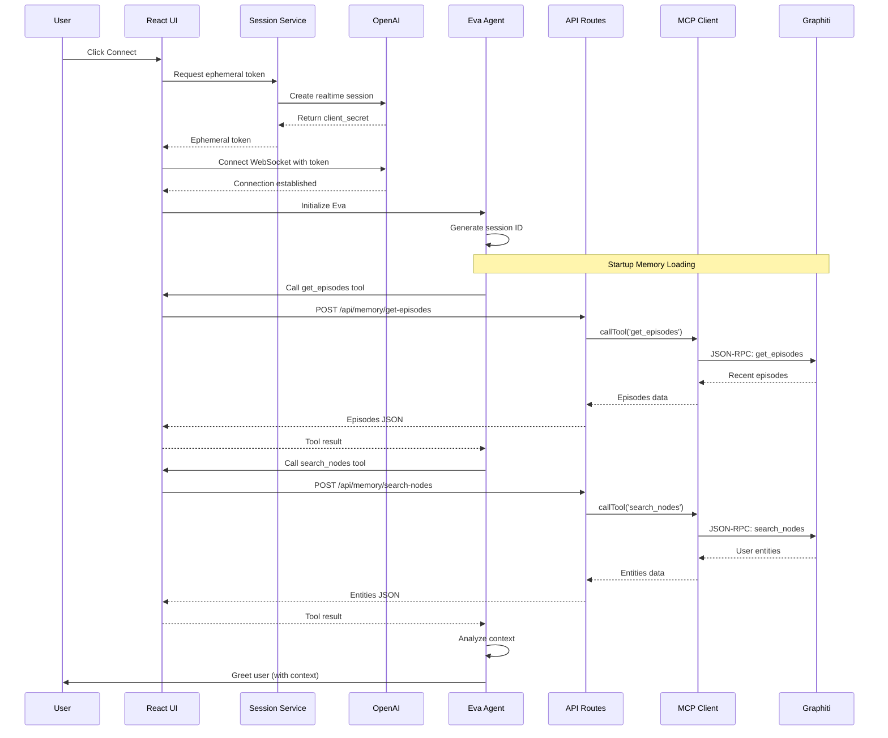

### Memory Save Flow

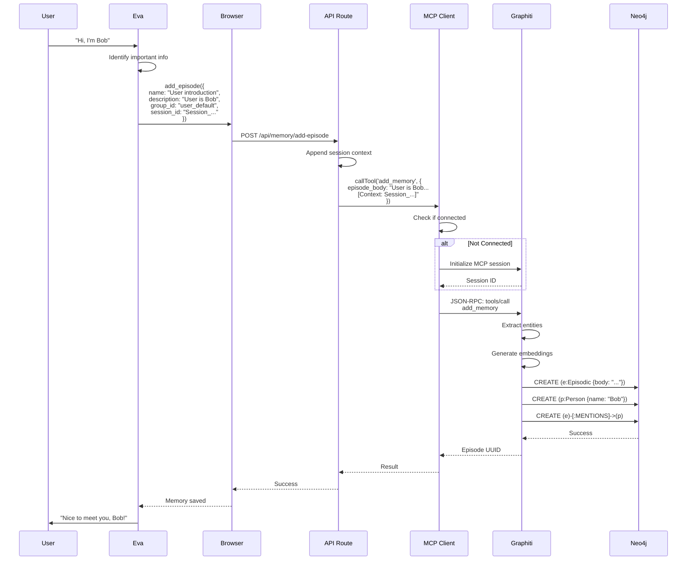

### Memory Retrieval Flow

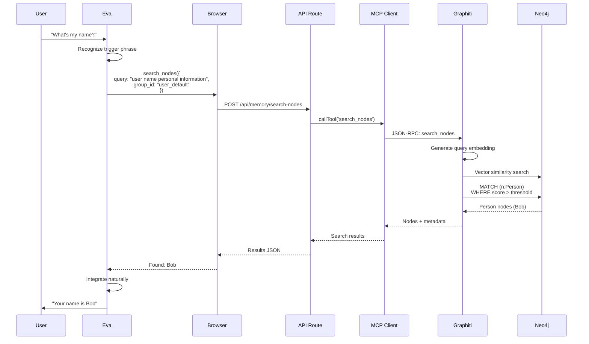

## Security Model

### Authentication & Authorization

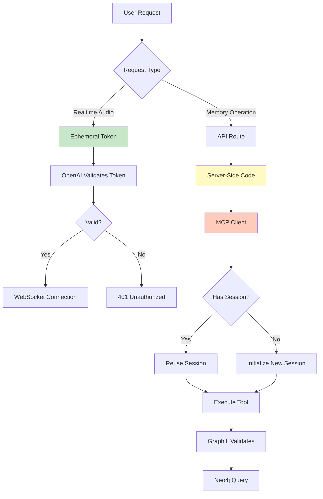

### Security Layers

| **Layer** | **Protection** | **Implementation** |
|-----------|----------------|-------------------|
| **API Key** | Never exposed to client | Stored in `.env.local`, server-only |
| **Ephemeral Tokens** | Short-lived, scoped | Generated per-session |
| **MCP Client** | Server-side only | Runtime check for `window` |
| **API Routes** | Validation & sanitization | Input validation on all endpoints |
| **Graph Access** | No direct client access | MCP layer abstracts Neo4j |
| **Tool Execution** | Validated by OpenAI | JSON schema enforcement |

## Memory System

### Knowledge Graph Schema

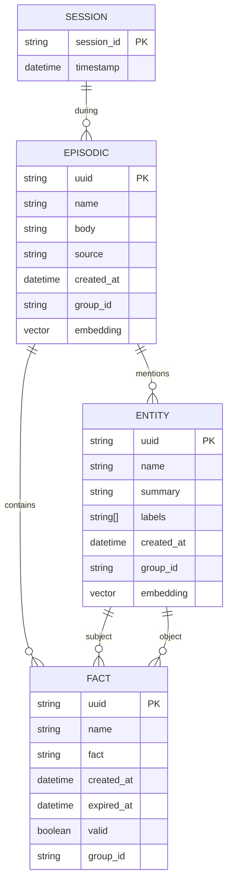

### Entity Types & Relationships

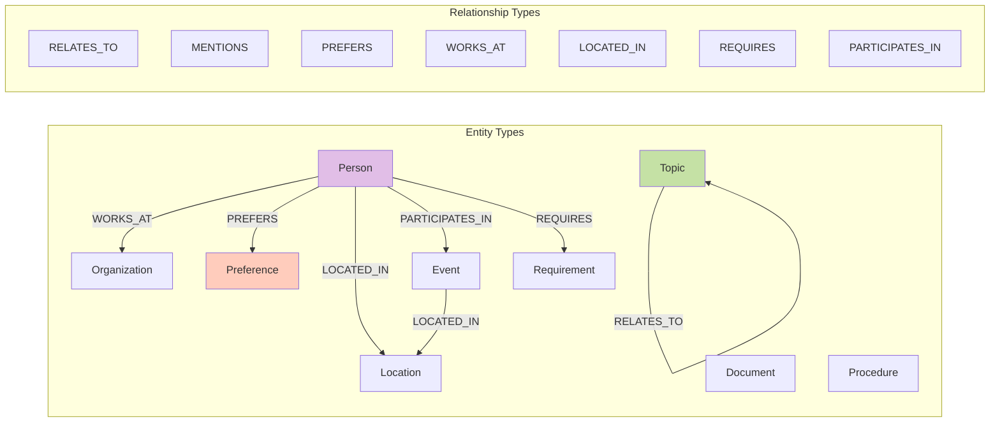

### Memory Retrieval Strategy

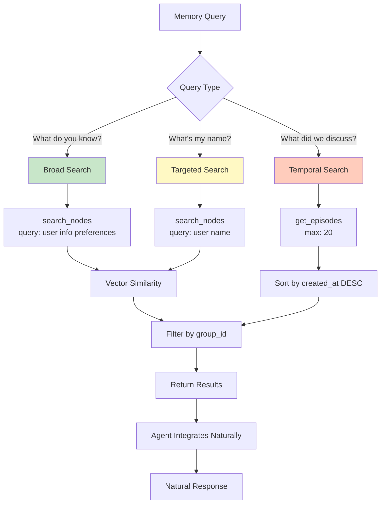

## API Design

### REST Endpoints

| **Endpoint** | **Method** | **Purpose** | **Auth** |
|--------------|------------|-------------|----------|
| `/api/session` | POST | Generate ephemeral token | Server |
| `/api/memory/add-episode` | POST | Save new memory | None* |
| `/api/memory/search-nodes` | POST | Search entities | None* |
| `/api/memory/search-facts` | POST | Search relationships | None* |
| `/api/memory/get-episodes` | POST | Get recent history | None* |
| `/api/memory/delete-episode` | POST | Delete specific memory | None* |
| `/api/memory/delete-entity-edge` | POST | Delete relationship | None* |
| `/api/memory/forget` | POST | Clear all memories | None* |

*Note: In production, add authentication middleware (JWT, session cookies, etc.)

### API Request/Response Examples

**Add Episode:**
```typescript
// Request
POST /api/memory/add-episode
{
  "name": "User introduction",
  "description": "User is Bob, a software engineer",
  "source": "message",
  "source_description": "User chat",
  "group_id": "user_default",
  "session_id": "Session_2025-11-21_abc123"
}

// Response
{
  "content": [
    {
      "type": "text",
      "text": "{\"uuid\": \"ep_123...\", \"created_at\": \"2025-11-21T...\"}"
    }
  ]
}
```

**Search Nodes:**
```typescript
// Request
POST /api/memory/search-nodes
{
  "query": "user name personal information",
  "group_id": "user_default",
  "entity_types": ["Person"]  // Optional
}

// Response
{
  "content": [
    {
      "type": "text",
      "text": "{\"nodes\": [{\"uuid\": \"...\", \"name\": \"Bob\", \"summary\": \"...\"}]}"
    }
  ]
}
```

### MCP Protocol Flow

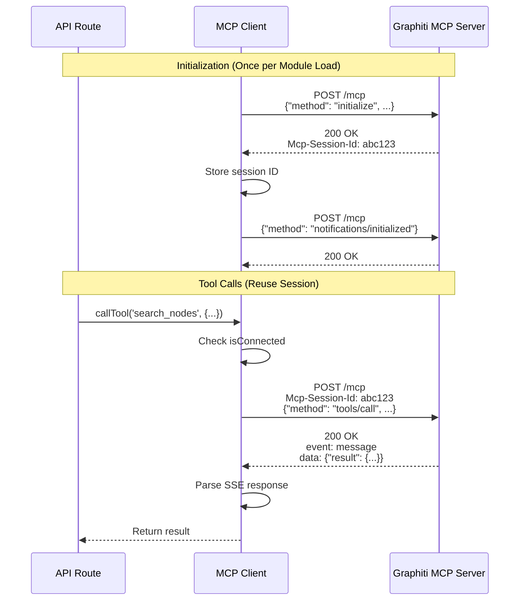

### Error Handling

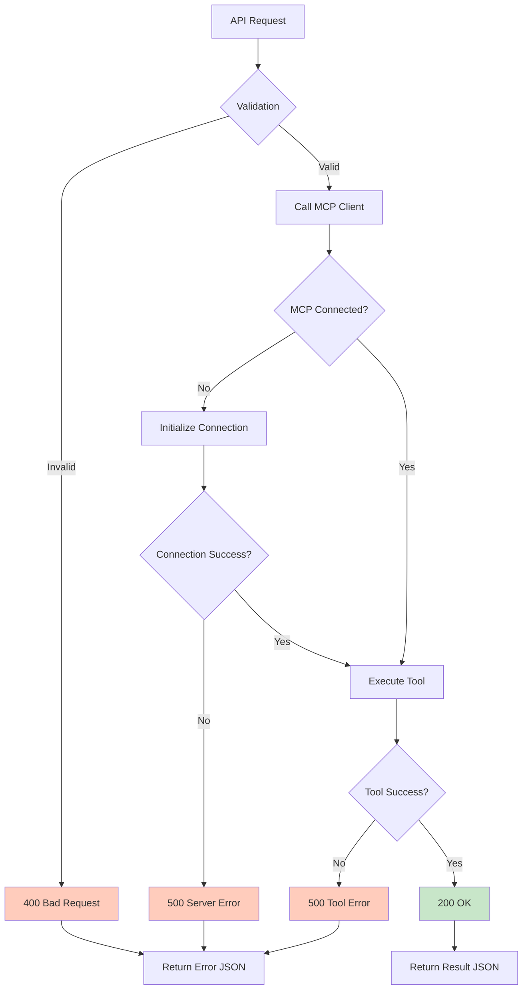

## Performance Optimizations

### MCP Client Singleton Pattern

```typescript
// Global singleton - persists across hot reloads
const globalForMCP = globalThis as unknown as {
  mcpClient: MCPClient | undefined;
};

export const mcpClient =
  globalForMCP.mcpClient ??
  new MCPClient(process.env.MCP_SERVER_URL);

if (typeof window === 'undefined') {
  globalForMCP.mcpClient = mcpClient;
}
```

**Benefits:**
- ✅ Single persistent MCP session
- ✅ No duplicate connections
- ✅ Survives Next.js hot reloads
- ✅ No EventEmitter warnings

### Lazy Connection

```typescript
async callTool(name: string, args: any): Promise<any> {
  if (!this.isConnected) {
    await this.connect();  // Connect on first use
  }
  // Execute tool...
}
```

**Benefits:**
- ✅ No connection until needed
- ✅ Reuses existing session
- ✅ Fast subsequent calls

## Deployment Considerations

### Production Checklist

- [ ] Add authentication middleware to API routes
- [ ] Set up rate limiting (prevent abuse)
- [ ] Configure CORS properly
- [ ] Use production database (not Docker)
- [ ] Set up monitoring (Sentry, DataDog)
- [ ] Enable HTTPS
- [ ] Implement user sessions (multi-user support)
- [ ] Add backup strategy for Neo4j
- [ ] Configure environment variables securely
- [ ] Add analytics & telemetry

### Scaling Strategy

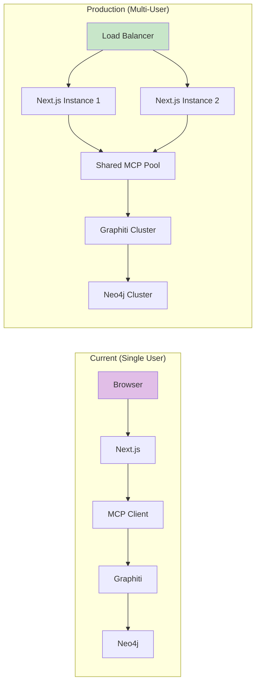

---

**Last Updated:** 2025-11-21
**Version:** 1.0.0
