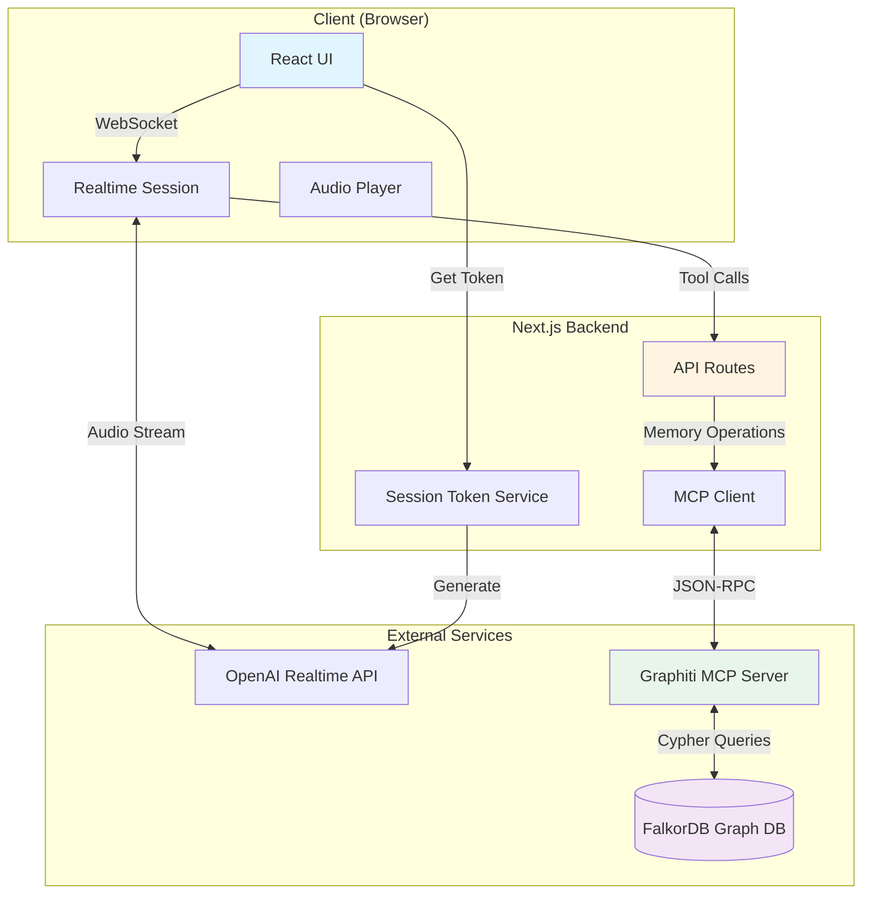
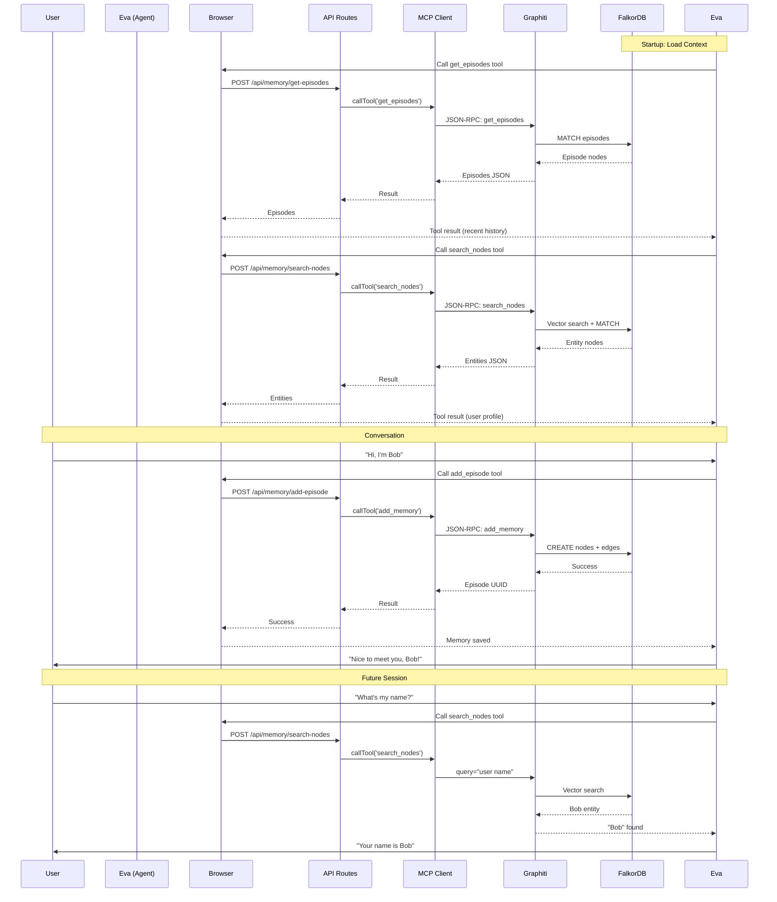

# Eva - Your Personalized AI Companion

<div align="center">
  
</div>

Eva is a warm, intelligent AI companion with **episodic memory** powered by a knowledge graph. She remembers your conversations, preferences, and personal details across sessions, creating natural, context-aware interactions through real-time voice conversations.

## 🌟 Key Features

- **🎙️ Real-time Voice Conversations** - Natural, low-latency audio interactions using OpenAI Realtime API
- **🧠 Episodic Memory** - Remembers conversations and personal details using Graphiti + FalkorDB knowledge graph
- **💭 Natural Context Awareness** - Recalls information naturally, like a friend would remember
- **🔒 Secure Architecture** - Server-side memory operations, client-side voice for optimal security and performance
- **🎨 Clean, Modern UI** - Minimalist interface with visual feedback during conversations
- **📊 Debug Mode** - View conversation transcripts and system events in real-time

## 🏗️ Architecture Overview



## 🔄 Memory System Flow



## 🛠️ Technology Stack

### Frontend
- **Next.js 16** - React framework with App Router
- **TypeScript** - Type-safe development
- **Tailwind CSS** - Utility-first styling
- **OpenAI Agents SDK** - Realtime agent framework
- **Radix UI** - Accessible UI components

### Backend
- **Next.js API Routes** - Serverless API endpoints
- **MCP (Model Context Protocol)** - Standard protocol for AI-graph communication
- **OpenAI Realtime API** - Low-latency voice conversations

### Memory & Data
- **Graphiti** - Temporal knowledge graph for AI agents
- **FalkorDB** - Graph database (Redis module)
- **Vector Embeddings** - Semantic search capabilities

## 📁 Project Structure

```
Eva/
├── app/
│   ├── api/                      # Backend API routes
│   │   ├── memory/              # Memory operation endpoints
│   │   │   ├── add-episode/     # Save new memory
│   │   │   ├── search-nodes/    # Search entities
│   │   │   ├── search-facts/    # Search relationships
│   │   │   ├── get-episodes/    # Get recent history
│   │   │   ├── delete-episode/  # Delete specific memory
│   │   │   ├── delete-entity-edge/ # Delete relationship
│   │   │   └── forget/          # Clear all memories
│   │   └── session/             # OpenAI session tokens
│   ├── lib/
│   │   ├── agents/
│   │   │   ├── chat.ts          # Main Eva agent configuration
│   │   │   ├── persona.ts       # Personality & behavior instructions
│   │   │   ├── executor.ts      # Memory tool definitions
│   │   │   └── tools/           # Additional agent tools
│   │   ├── client.ts            # MCP client (server-side only)
│   │   ├── memory.ts            # Memory type definitions
│   │   └── services/            # Service layer
│   ├── components/              # React components
│   └── page.tsx                 # Main application entry
├── docker-compose.yml           # Graphiti + FalkorDB services
└── next.config.ts              # Next.js configuration
```

## 🚀 Getting Started

### Prerequisites

- **Node.js 18+**
- **Docker & Docker Compose**
- **OpenAI API Key** with Realtime API access

### Installation

1. **Clone the repository**
   ```bash
   git clone https://github.com/athrael-soju/Eva.git
   cd eva
   ```

2. **Install dependencies**
   ```bash
   npm install
   ```

3. **Configure environment variables**

   Create `.env.local`:
   ```bash
   OPENAI_API_KEY=sk-...
   OPENAI_REALTIME_MODEL=gpt-4o-realtime-preview-2024-12-17
   MCP_SERVER_URL=http://localhost:8000/mcp
   ```

4. **Start Graphiti & FalkorDB**
   ```bash
   docker-compose up -d
   ```

5. **Start the development server**
   ```bash
   npm run dev
   ```

6. **Open Eva**

   Navigate to [http://localhost:3000](http://localhost:3000)

## 💡 How to Use

### Starting a Conversation

1. **Connect** - Click the loading animation or press the connect button
2. **Allow microphone access** when prompted
3. **Wait for Eva to greet you** - She'll retrieve her memories about you first
4. **Start talking** - Speak naturally, Eva will respond in real-time

### Memory Features

Eva automatically remembers:
- ✅ **Personal details** - Your name, role, location, organization
- ✅ **Preferences** - Likes, dislikes, opinions
- ✅ **Topics of interest** - What you care about
- ✅ **Past events** - Important moments from conversations
- ✅ **Goals & requirements** - Your objectives and commitments

### Asking Eva to Remember

```
"What do you know about me?"
"What's my name?"
"Do you remember what we talked about?"
"What are my preferences?"
```

### Managing Memories

**Forget Everything:**
```
"Forget everything"
"Clear all memories"
```
Eva will ask for confirmation before permanently deleting all memories.

### Debug Mode

Click the gear icon (⚙️) in the top-right to toggle debug mode:
- **Transcript** - See conversation history
- **Events** - View system events and tool calls
- **Controls** - Manual connection, PTT mode, codec selection

## 🔐 Security Architecture

### Ephemeral Token Pattern (Client-Side Realtime)
```
Browser ──[Request Token]──> Backend ──[Generate]──> OpenAI
Browser ──[Connect with Token]──────────────────────> OpenAI
        ⬆ Low latency, no API key exposure
```

### Memory Operations (Server-Side Only)
```
Browser ──[Tool Call]──> API Route ──[MCP Client]──> Graphiti
        ⬆ Secure                    ⬆ Server-side only
```

**Security Benefits:**
- ✅ OpenAI API key never exposed to browser
- ✅ MCP credentials stay server-side
- ✅ Graph database access fully protected
- ✅ Low-latency audio (direct browser-to-OpenAI)

## 🧠 Memory System Details

### Knowledge Graph Structure

```
Episodes (Episodic Memory)
    ↓
Entities (Nodes)
    - Person
    - Preference
    - Topic
    - Event
    - Location
    - Organization
    - Document
    - Requirement
    - Procedure
    ↓
Facts (Relationships/Edges)
    - RELATES_TO
    - MENTIONS
    - PREFERS
    - WORKS_AT
    - etc.
```

### Memory Retrieval Strategy

**Startup (Broad Context):**
- `get_episodes(max=15)` - Recent conversation history
- `search_nodes(query="user preferences personal information goals")` - User profile

**During Conversation (Targeted):**
- Specific queries based on user questions
- Fresh searches even with cached context
- Semantic search for best relevance

### Session Linking

Each conversation session is tracked:
```
Session_2025-11-21T16-58-46-211Z_840914cd
    ↓ [MENTIONS]
Episodes saved during this session
    ↓ [EXTRACTS]
Entities & Facts
```

## 🎨 Agent Personality

Eva is designed to be:
- **Warm & Authentic** - Genuinely caring, not artificially cheerful
- **Curious** - Shows real interest in your thoughts and experiences
- **Insightful** - Offers fresh perspectives when helpful
- **Present** - Fully engaged in the conversation
- **Natural** - Uses memory invisibly, like a friend would remember

### Natural Memory Integration

**❌ Robotic (Avoid):**
- "I retrieved information that you prefer tea"
- "According to my records, we discussed this last week"

**✅ Natural (Goal):**
- User: "I'm stressed" → Eva: "Is it the project deadline you mentioned?"
- Eva greets: "Hey! How did that presentation go?"

## 🛠️ Development

### Available Scripts

```bash
npm run dev          # Start development server
npm run build        # Build for production
npm run start        # Start production server
npm run lint         # Run ESLint
npm run type-check   # TypeScript type checking
```

### Adding New Memory Tools

1. **Define tool in `app/lib/agents/executor.ts`**
2. **Create API route in `app/api/memory/[tool-name]/route.ts`**
3. **Add tool to agent in `app/lib/agents/chat.ts`**
4. **Update instructions in `app/lib/agents/persona.ts`**

Example tool structure:
```typescript
export const myNewTool = {
    type: 'function' as const,
    name: 'my_tool',
    description: 'What this tool does',
    parameters: { /* JSON schema */ },
    invoke: async (_context, input) => {
        // Call API route
        const response = await fetch('/api/memory/my-tool', {
            method: 'POST',
            headers: { 'Content-Type': 'application/json' },
            body: JSON.stringify(JSON.parse(input))
        });
        return JSON.stringify(await response.json());
    }
};
```

## 🐛 Troubleshooting

### MCP Connection Issues
```bash
# Check Graphiti is running
docker ps | grep graphiti

# View Graphiti logs
docker logs eva-graphiti-1

# Restart services
docker-compose restart
```

### Memory Not Persisting
- Check FalkorDB is running: `docker ps | grep falkordb`
- Verify `group_id="user_default"` is used consistently
- Check browser console for API errors

### Audio Issues
- Ensure microphone permissions are granted
- Check browser supports Web Audio API
- Verify OpenAI API key has Realtime API access

## 📊 Monitoring

### View Knowledge Graph
FalkorDB Web UI: [http://localhost:3003](http://localhost:3003)

**Query Examples:**
```cypher
// View all nodes
MATCH (n) RETURN n LIMIT 25

// View user's graph
GRAPH.QUERY user_default "MATCH (n) RETURN n LIMIT 50"

// Find episodes
GRAPH.QUERY user_default "MATCH (e:Episodic) RETURN e"

// Find relationships
GRAPH.QUERY user_default "MATCH (a)-[r]->(b) RETURN a, r, b LIMIT 25"
```

## 🤝 Contributing

Contributions are welcome! Please:
1. Fork the repository
2. Create a feature branch
3. Make your changes with tests
4. Submit a pull request

## 📄 License

[Your License Here]

## 🙏 Acknowledgments

- **OpenAI** - Realtime API & GPT-4o
- **Graphiti** - Temporal knowledge graph framework
- **FalkorDB** - High-performance graph database
- **Zep AI** - Knowledge graph MCP server

---

Built with ❤️ by [Your Name]
