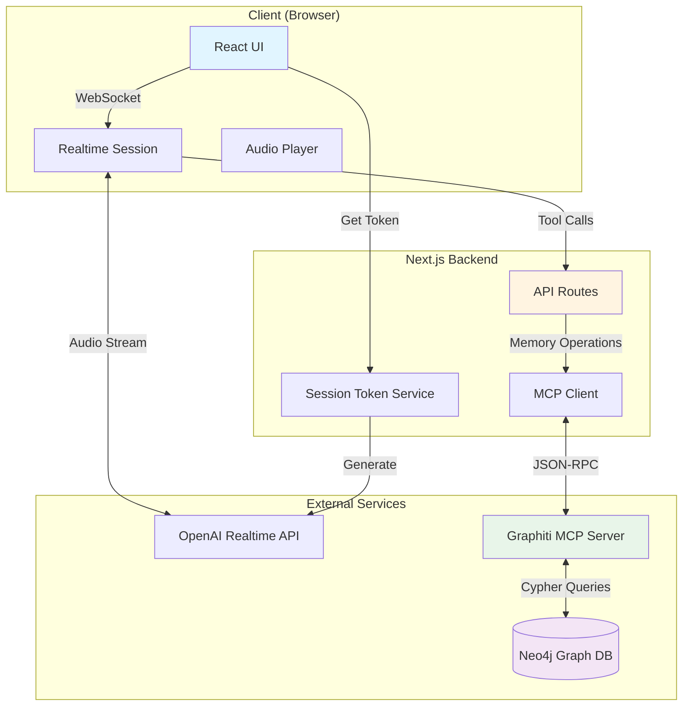

# Plucky - A personalized, Agentic Voice Assistant

<div align="center">
  
</div>

Plucky is a warm, intelligent AI companion with **episodic memory** powered by a knowledge graph. She remembers your conversations, preferences, and personal details across sessions, creating natural, context-aware interactions through real-time voice conversations.

## 🌟 Key Features

- **🎙️ Real-time Voice Conversations** - Natural, low-latency audio interactions using OpenAI Realtime API
- **🧠 Episodic Memory** - Remembers conversations and personal details using Graphiti + Neo4j knowledge graph
- **💭 Natural Context Awareness** - Recalls information naturally, like a friend would remember
- **🔒 Secure Architecture** - Server-side memory operations, client-side voice for optimal security and performance
- **🎨 Clean, Modern UI** - Minimalist interface with visual feedback during conversations
- **📊 Debug Mode** - View conversation transcripts and system events in real-time

## 🏗️ Architecture Overview



## 🔄 How Memory Works

**On Startup:** Plucky retrieves recent conversation history and user profile from the knowledge graph.

**During Conversation:** When you share information, Plucky saves it as episodes with entities (people, preferences, events) and relationships.

**Future Sessions:** Plucky searches the graph semantically to recall relevant information naturally.

## 🛠️ Technology Stack

### Frontend
- **Next.js 16** - React framework with App Router
- **TypeScript** - Type-safe development
- **Tailwind CSS** - Utility-first styling
- **OpenAI Agents SDK** - Realtime agent framework
- **Radix UI** - Accessible UI components

### Backend
- **Next.js API Routes** - Serverless API endpoints
- **MCP (Model Context Protocol)** - Standard protocol for AI-graph communication
- **OpenAI Realtime API** - Low-latency voice conversations

### Memory & Data
- **Graphiti** - Temporal knowledge graph for AI agents
- **Neo4j** - Graph database
- **Vector Embeddings** - Semantic search capabilities

## 📁 Project Structure

```
Plucky/
├── app/
│   ├── api/
│   │   ├── memory/              # Memory operation endpoints
│   │   └── session/             # OpenAI session tokens
│   ├── lib/
│   │   ├── agents/              # Agent configuration & tools
│   │   ├── client.ts            # MCP client (server-side)
│   │   └── services/            # Service layer
│   ├── components/              # React components
│   └── page.tsx                 # Main entry point
└── docker-compose.yml           # Graphiti + Neo4j services
```

## 🚀 Getting Started

### Prerequisites

- **Node.js 18+**
- **Docker & Docker Compose**
- **OpenAI API Key** with Realtime API access

### Installation

1. **Clone the repository**
   ```bash
   git clone https://github.com/athrael-soju/Plucky.git
   cd plucky
   ```

2. **Install dependencies**
   ```bash
   npm install
   ```

3. **Configure environment variables**

   Create `.env.local`:
   ```bash
   OPENAI_API_KEY=sk-...
   OPENAI_REALTIME_MODEL=gpt-4o-realtime-preview-2024-12-17
   MCP_SERVER_URL=http://localhost:8000/mcp
   ```

4. **Start Graphiti & Neo4j**
   ```bash
   docker compose up -d
   ```

5. **Start the development server**
   ```bash
   npm run dev
   ```

6. **Open Plucky**

   Navigate to [http://localhost:3000](http://localhost:3000)

## 💡 How to Use

1. **Connect** - Click the connect button and allow microphone access
2. **Wait for greeting** - Plucky retrieves her memories about you first
3. **Start talking** - Speak naturally, she responds in real-time

### What Plucky Remembers

- ✅ Personal details (name, role, location)
- ✅ Preferences and opinions
- ✅ Topics of interest
- ✅ Past events and conversations
- ✅ Goals and commitments

**Ask about memories:** *"What do you know about me?"* or *"Do you remember what we talked about?"*

**Clear memories:** *"Forget everything"* (requires confirmation)

**Debug mode:** Click ⚙️ to view transcripts, events, and controls

## 🔐 Security

- **Client-Side Audio:** Direct browser-to-OpenAI connection with ephemeral tokens (low latency, no key exposure)
- **Server-Side Memory:** All database operations through backend API (credentials never exposed)
- **Protected Access:** API keys and MCP credentials stay server-side

## 🧠 Memory System

Plucky uses a knowledge graph with three layers:
- **Episodes:** Conversation memories with timestamps
- **Entities:** People, preferences, topics, events, locations, etc.
- **Facts:** Relationships between entities (PREFERS, WORKS_AT, RELATES_TO, etc.)

Memories are retrieved through semantic search, providing relevant context for natural conversations.

## 🎨 Agent Personality

Plucky is designed to be:
- **Warm & Authentic** - Genuinely caring, not artificially cheerful
- **Curious** - Shows real interest in your thoughts and experiences
- **Insightful** - Offers fresh perspectives when helpful
- **Present** - Fully engaged in the conversation
- **Natural** - Uses memory invisibly, like a friend would remember

### Natural Memory Integration

**❌ Robotic (Avoid):**
- "I retrieved information that you prefer tea"
- "According to my records, we discussed this last week"

**✅ Natural (Goal):**
- User: "I'm stressed" → Plucky: "Is it the project deadline you mentioned?"
- Plucky greets: "Hey! How did that presentation go?"

## 🛠️ Development

```bash
npm run dev          # Start development server
npm run build        # Build for production
npm run lint         # Run ESLint
npm run type-check   # TypeScript type checking
```

## 🐛 Troubleshooting

**MCP Connection:** Check `docker ps` and `docker logs plucky-graphiti-mcp-1`, restart with `docker compose restart`

**Memory Issues:** Verify Neo4j is running, check browser console for API errors

**Audio Issues:** Ensure microphone permissions granted and OpenAI API key has Realtime API access

## 📊 Monitoring

**Neo4j Browser:** [http://localhost:7474](http://localhost:7474) (username: `neo4j`, password: `demodemo`)

View your knowledge graph:
```cypher
// View all nodes
MATCH (n) WHERE n.group_id = 'user_default' RETURN n LIMIT 25

// View relationships
MATCH (a)-[r]->(b) WHERE a.group_id = 'user_default' RETURN a, r, b LIMIT 25
```

## 🤝 Contributing

Contributions are welcome! Please:
1. Fork the repository
2. Create a feature branch
3. Make your changes with tests
4. Submit a pull request

## 📄 License

MIT

## 🙏 Acknowledgments

- **OpenAI** - Realtime API & GPT-5
- **Graphiti** - Temporal knowledge graph framework
- **Neo4j** - Graph database platform
- **Zep AI** - Knowledge graph MCP server

---
