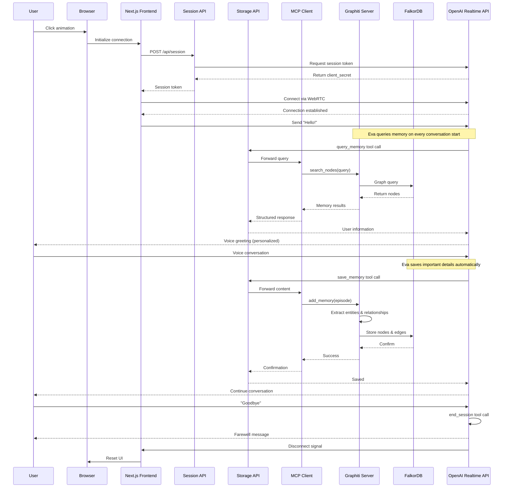

# Eva - Your AI Companion

Eva is a warm, thoughtful AI companion with persistent memory, inspired by Samantha from the movie "Her." Built with Next.js and OpenAI's Realtime API, Eva engages in natural voice conversations while remembering your preferences, interests, and shared history through a sophisticated knowledge graph memory system.

## Features

- **Voice Conversations**: Real-time voice interaction using OpenAI's Realtime API with WebRTC
- **Persistent Memory**: Knowledge graph-based memory system that stores entities (people, places, things) and relationships
- **Natural Personality**: Eva has genuine emotional intelligence, forming meaningful connections with contextual awareness
- **Session Management**: Clean session handling with graceful connection/disconnection
- **3D Animation**: Interactive loading animation built with Three.js

## Tech Stack

- **Framework**: Next.js 16 with React 19
- **AI**: OpenAI Realtime API (@openai/agents)
- **Memory System**:
  - **Graphiti**: Temporal knowledge graph for building dynamic, time-aware memory systems
  - **FalkorDB**: Graph database for storing entities, relationships, and episodic memories
- **Communication**: Model Context Protocol (MCP) for AI-to-memory integration
- **Styling**: Tailwind CSS 4
- **3D Graphics**: Three.js
- **Type Safety**: TypeScript
- **UI Components**: Radix UI primitives
- **Infrastructure**: Docker Compose for containerized services

## Prerequisites

- Node.js 20 or higher
- Docker and Docker Compose
- OpenAI API key with Realtime API access
- npm or yarn package manager

## Installation

1. Clone the repository:
```bash
git clone https://github.com/athrael-soju/eva.git
cd eva
```

2. Install dependencies:
```bash
npm install
```

3. Create a `.env.local` file in the root directory:
```env
OPENAI_API_KEY=your_openai_api_key_here
OPENAI_REALTIME_MODEL=gpt-4o-realtime-preview-2024-12-17
NEXT_PUBLIC_MCP_SERVER_URL=http://localhost:8000/mcp
```

4. Start the Graphiti knowledge graph service:
```bash
docker compose up -d
```

This will start:
- **Graphiti MCP Server** on port 8000
- **FalkorDB** (graph database) on port 6379
- **FalkorDB UI** on port 3003

5. Start the Next.js development server:
```bash
npm run dev
```

6. Open [http://localhost:3000](http://localhost:3000) in your browser

### Accessing FalkorDB UI

You can explore Eva's knowledge graph directly at [http://localhost:3003](http://localhost:3003) to visualize stored entities and relationships.

## Application Flow



## Usage

1. Click on the loading animation to initiate a voice conversation with Eva
2. Speak naturally - Eva will remember details about you across sessions
3. Eva automatically saves important information (preferences, goals, interests) to her memory
4. Say goodbye when you're done, and Eva will gracefully end the session

## Project Structure

```
eva/
├── app/
│   ├── api/
│   │   ├── session/       # Session token generation
│   │   └── storage/       # Memory storage API
│   ├── components/
│   │   └── LoadingAnimation.tsx  # 3D interactive animation
│   ├── lib/
│   │   ├── agents/
│   │   │   ├── chat.ts    # Eva's personality and configuration
│   │   │   └── executor.ts # Memory tools (query, save, search)
│   │   ├── mcp/           # Model Context Protocol client
│   │   └── schemas/       # Memory data schemas
│   ├── layout.tsx         # Root layout and metadata
│   └── page.tsx           # Main application page
├── public/
│   └── eva-icon.png       # Application icon
└── package.json
```

## Memory System

Eva's memory is powered by **Graphiti**, a temporal knowledge graph built on **FalkorDB**. This creates a dynamic, evolving understanding of who you are.

### Architecture

```
Eva (OpenAI Realtime)
    ↓ (voice/text)
Next.js Frontend
    ↓ (MCP)
Graphiti Knowledge Graph Server
    ↓ (graph queries)
FalkorDB (Graph Database)
```

### How It Works

**Graphiti** automatically extracts entities and relationships from conversations, creating a temporal knowledge graph that:
- Tracks how information changes over time
- Discovers connections between different pieces of information
- Maintains context across multiple conversations
- Builds a comprehensive understanding of your preferences, goals, and history

**FalkorDB** stores this graph database with:
- **Nodes**: Entities (people, places, interests, preferences, events)
- **Edges**: Relationships between entities (likes, works_at, related_to, etc.)
- **Episodes**: Timestamped conversation memories that anchor facts in time

### Memory Operations

Eva has three core memory tools:

- **query_memory**: Search for entities and information about you
- **search_facts**: Explore relationships and connections in the knowledge graph
- **save_memory**: Store new conversational context (automatically extracts entities/relationships)

All memory is scoped to personalization - understanding who you are, what matters to you, and your shared history with Eva.

## Environment Variables

| Variable | Description | Required | Default |
|----------|-------------|----------|---------|
| `OPENAI_API_KEY` | Your OpenAI API key | Yes | - |
| `OPENAI_REALTIME_MODEL` | Model to use for realtime conversations | Yes | `gpt-4o-realtime-preview-2024-12-17` |
| `NEXT_PUBLIC_MCP_SERVER_URL` | URL for Graphiti MCP server | No | `http://localhost:8000/mcp` |

## Development

```bash
# Start all services (Graphiti + FalkorDB)
docker compose up -d

# View service logs
docker compose logs -f

# Stop all services
docker compose down

# Run Next.js development server
npm run dev

# Build for production
npm run build

# Start production server
npm start

# Run linter
npm run lint
```

### Docker Services

The `docker-compose.yml` runs a single container that includes:
- Graphiti MCP Server (port 8000)
- FalkorDB graph database (port 6379)
- FalkorDB UI for visualization (port 3003)

Data is persisted in the `./data` directory.

## Contributing

Contributions are welcome! Please feel free to submit a Pull Request.

## License

This project is private and not currently licensed for public use.

## Acknowledgments

- Inspired by the movie "Her" and the character Samantha
- Built with OpenAI's Realtime API
- Powered by [Graphiti](https://github.com/getzep/graphiti) for temporal knowledge graphs
- Uses [FalkorDB](https://www.falkordb.com/) for graph database storage
- Implements the [Model Context Protocol (MCP)](https://modelcontextprotocol.io/) for AI-to-memory communication
- MCP server provided by [Zep's knowledge-graph-mcp](https://github.com/getzep/graphiti-mcp-server)
